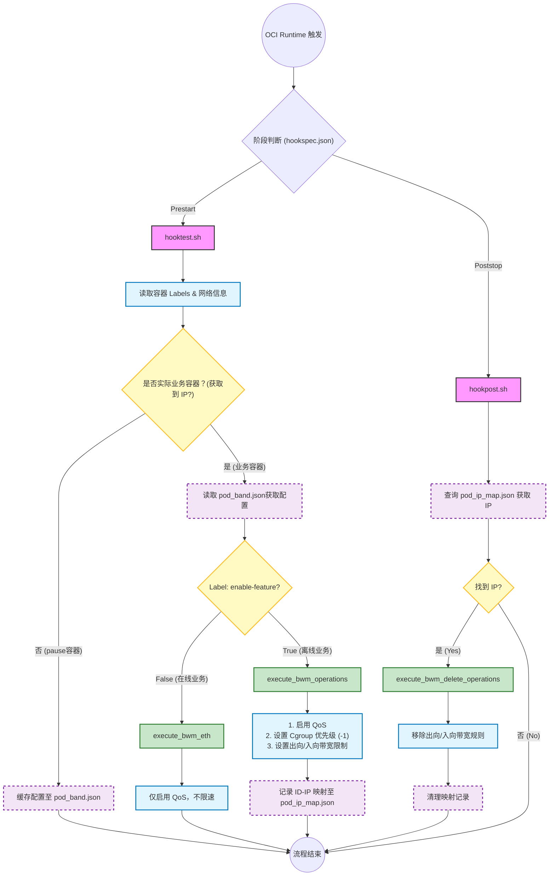

# ONCN-BWM OCI Hook Integration

## 项目简介

本项目实现了一套基于 **OCI Hook** (Open Container Initiative Hooks) 和 **eBPF** 的容器网络带宽管理系统。通过拦截容器的生命周期事件（Prestart 和 Poststop），自动识别容器的业务属性（在线/离线），并下发相应的流量控制策略，实现精细化的带宽隔离与共享。

核心功能：

- **自动化管理**：无需手动干预，容器启动即限制，停止即清理。
- **业务分级**：区分“在线业务”（高优先级，不限流）与“离线业务”（低优先级，受限）。
- **双向控制**：支持入向（Ingress）和出向（Egress）的带宽限制。

------

## 1. OCI Hook 工作流程

本系统利用 OCI Runtime 的 Hook 机制，在容器启动前和停止后执行脚本。

### 1.1 流程图

### 1.2 关键脚本说明

- **`hookspec.json`**: 定义挂钩触发规则。
- **`hooktest.sh` (Prestart)**:
  - 检查容器 Label `annotation.enable-feature`。
  - 如果为 `true` (离线业务)，调用 `bwmcli` 设置 Cgroup 优先级为 `-1`，并根据 `bandwidth-ingress/egress` 设置具体限速值。
  - 将 Pod ID 与 IP 的映射关系写入 `/tmp/pod_ip_map.json`（用于停止时清理）。
- **`hookpost.sh` (Poststop)**:
  - 容器停止后，网络命名空间已销毁，无法直接获取 IP。
  - 通过读取 `/tmp/pod_ip_map.json` 找回该容器的 IP，调用 `bwmcli` 清理对应的流控规则。

------

## 2. bwmcli 使用指南

`bwmcli` 是用户态配置工具，负责加载 BPF 程序并更新 Map 配置。以下是 Hook 脚本中使用的主要命令：

### 2.1 基础控制

| **命令**   | **说明**                                                  | **示例**             |
| ---------- | --------------------------------------------------------- | -------------------- |
| `-e [eth]` | **Enable Egress**: 在指定网卡启用出向 QoS (加载 TC BPF)。 | `bwmcli -e eth0`     |
| `-E [eth]` | **Enable Ingress**: 在指定网卡启用入向 QoS。              | `bwmcli -E veth1234` |
| `-d [eth]` | **Disable Egress**: 禁用出向 QoS。                        | `bwmcli -d eth0`     |
| `-D [eth]` | **Disable Ingress**: 禁用入向 QoS。                       | `bwmcli -D veth1234` |

### 2.2 带宽策略配置

| **命令**           | **说明**                                                     | **示例**                          |
| ------------------ | ------------------------------------------------------------ | --------------------------------- |
| `-s [path] [prio]` | **Set Cgroup Prio**: 设置 Cgroup 路径的网络优先级。 `0`: 在线 (默认) `-1`: 离线 | `bwmcli -s /sys/fs/cgroup/... -1` |
| `-a [ip] [bw]`     | **Add Egress Rule**: 为指定 IP 添加**出向**带宽限制。 格式: `低水位带宽,高水位带宽` | `bwmcli -a 10.244.1.2 20mb,100mb` |
| `-A [ip] [bw]`     | **Add Ingress Rule**: 为指定 IP 添加**入向**带宽限制。       | `bwmcli -A 10.244.1.2 20mb,100mb` |
| `-r [ip]`          | **Remove Egress**: 移除指定 IP 的出向规则。                  | `bwmcli -r 10.244.1.2`            |
| `-R [ip]`          | **Remove Ingress**: 移除指定 IP 的入向规则。                 | `bwmcli -R 10.244.1.2`            |

------

## 3. BPF 程序逻辑解析

底层的流量控制由挂载在 TC (Traffic Control) 和 Cgroup 上的 eBPF 程序实现。

### 3.1 核心组件

1. **`bwm_prio_kern.c` (Cgroup Classifier)**
   - **挂载点**: `cgroup_skb/egress`
   - **逻辑**: 当容器内的进程发送数据包时，该程序根据 Map 中配置的优先级（通过 `bwmcli -s` 设置），修改数据包的 `skb->priority`。
   - **作用**: 将数据包标记为“在线”或“离线”。
2. **`bwm_tc.c` (Egress Traffic Control)**
   - **挂载点**: 物理网卡或 veth 的 TC Egress 挂载点。
   - **逻辑**:
     - **识别**: 读取数据包的 `skb->priority`（由上面的程序标记）或源 IP。
     - **离线处理**: 如果标记为离线，通过 **EDT (Earliest Departure Time)** 算法计算数据包的发送时间戳 `skb->tstamp`，从而限制发送速率。
     - **水线检测**: 实时统计在线业务流量。如果在线流量低于“水线”，允许离线业务使用高带宽（`high_rate`）；如果在线流量繁忙，将离线业务压制到低带宽（`low_rate`）。
3. **`bwm_tc_i.c` (Ingress Traffic Control)**
   - **挂载点**: 物理网卡或 veth 的 TC Egress (对端发送即本端接收) 或 Ingress。
   - **逻辑**:
     - **识别**: 解析数据包的 **目的 IP** (Destination IP)。
     - **查表**: 在 `ips_i_cfg_map` 查找该 IP 是否有配置入向限制规则。
     - **限速**: 同样使用 EDT 算法对目标为该 Pod IP 的流量进行整形。

### 3.2 带宽管理总结

- **在线业务**：默认优先级，不做 EDT 延迟，仅统计流量，保证低延迟和高吞吐。
- **离线业务**：低优先级，根据当前系统的整体负载（在线业务流量），在 `low_rate` 和 `high_rate` 之间动态调整，充分利用空闲带宽但不抢占在线业务资源。

